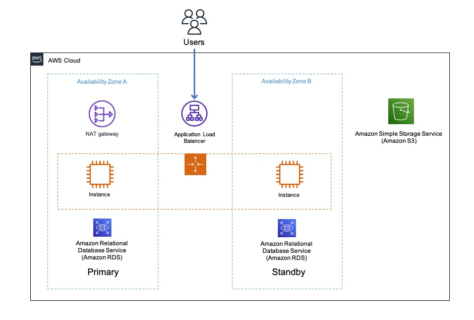
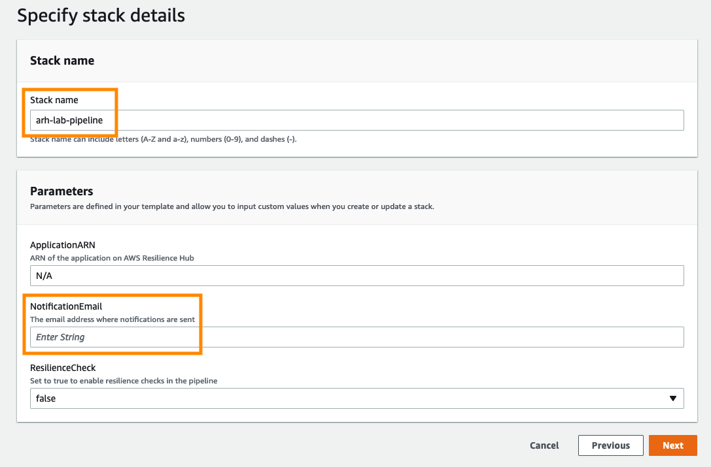
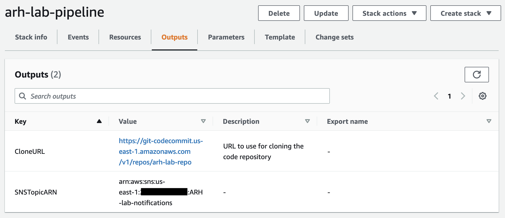
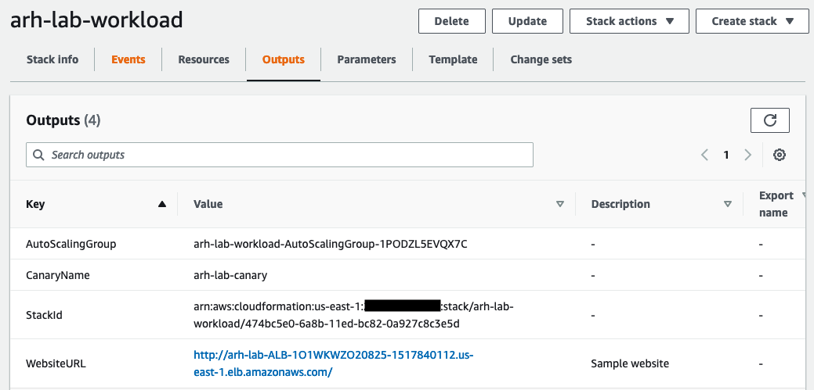

# [1. 워크로드 배포]()

## [아키텍처]()

아래 아키텍처 다이어그램은 우리가 사용할 응용 프로그램 인프라의 개요를 보여줍니다. Application Load Balancer, EC2 Auto Scaling 그룹의 EC2 인스턴스 Fleet 및 RDS 데이터베이스로 구성된 3티어 아키텍처입니다. EC2
인스턴스는 NAT 게이트웨이를 통해 아웃바운드 연결을 가지며 애플리케이션의
정적 자산은 S3 버킷에 저장됩니다.

<p align="center"></p>

AWS CloudFormation을 사용하여 이 실습에 필요한 리소스를 프로비저닝합니다.
프로비저닝하는 CloudFormation 스택은 Application Load Balancer, EC2 Auto Scaling 그룹의 EC2 인스턴스, NAT 게이트웨이 및 RDS 데이터베이스를 새 VPC에 생성합니다. 또한 스택은 SNS 주제와 CloudWatch Synthetics Canary를 생성합니다.

워크로드는 IaC(Infrastructure-as-Code)를 사용하여 인프라를 프로비저닝하고 관리하는 것과 같은 모범 사례를 따릅니다. IaC 템플릿에 대한 업데이트와 변경 사항 배포는 IaC 템플릿의 버전 제어를 위한 코드 리포지토리 사용 및 오케스트레이션 시스템을 사용하여 변경 사항을 배포하는 것과 같은 DevOps 사례를 사용하여 수행됩니다.

이 워크숍에서는 코드 리포지토리에 AWS CodeCommit을 사용하고 배포를 오케스트레이션하기 위해 AWS CodePipeline을 사용하여 이러한 모범 사례를 구현했습니다.

[CodePipeline을 사용한 지속적 전달](https://docs.aws.amazon.com/AWSCloudFormation/latest/UserGuide/continuous-delivery-codepipeline.html)에 대해 자세히 알아보기

## [배포]()

이 실습은 실습에 참여하시는 모든 분들이 이벤트 엔진을 각자 별도로 부여받아 수행하므로 고유한 자신의 계정을 가진 경우와 동일한 과정으로
진행됩니다.

### [템플릿 배포]()

1.  [pipeline.yaml](https://static.us-east-1.prod.workshops.aws/public/5a801e9b-1799-4eb6-90fe-6054bda3c7cc/static/resources/pipeline.yaml)
    CloudFormation 템플릿을 로컬 시스템에 다운로드합니다.

2.  [CloudFormation 콘솔](https://console.aws.amazon.com/cloudformation/home)로 이동하여 **Create Stack > With new resources (standard)** 를 클릭합니다.


3.  **"Prepare template"** 항목에서 **"Template is ready"** 를 선택하고, **"Template source"** 에서는 **"Upload a template file"** 을 선택합니다. 위 1에서 다운로드한 CloudFormation 템플릿을 선택하고 **Next**를 클릭합니다.

4.  **Stack name**에 다음을 입력합니다.
```
arh-lab-pipeline
```

5.  **NotificationEmail** 파라미터에 경보 알림을 수신할 이메일 주소를 입력합니다 (주의: 이 이메일 주소는 메시지 확인이 가능한 유효한 이메일 주소이어야 합니다). 다른 매개 변수에 대해서는 변경할 필요가 없습니다.


6.  **Review** 페이지로 이동할 때까지 **Next**를 클릭합니다. **"I acknowledge that AWS CloudFormation might create IAM resources with custom names."** 및 다른 확인란을 선택하고 **Submit**을 클릭합니다.

7.  스택 생성이 **CREATE_COMPLETE**에 도달할 때까지 기다립니다.
    -   **이메일 구독 확인**: 스택 생성이 완료되면 이메일(파라미터 값에 입력한 이메일)을 확인하고 SNS 주제 구독을 확인합니다.

8.  **Outputs(출력)** 탭으로 이동하여 출력의 키-값을 기록해 둡니다. 나중에 워크샵에서 사용할 것입니다.


워크로드에 대해 생성된 파이프라인은 워크로드 자체에 대한 리소스가 포함된 새 CloudFormation 스택을 배포합니다. VPC, 서브넷 및 게이트웨이와 같은네트워킹 리소스 외에도 ALB, EC2, RDS, S3 등과 같은 리소스 등이 생성됩니다.

1.  [CloudFormation 콘솔](https://console.aws.amazon.com/cloudformation/home)에서 이름이 **arh-lab-workload** 이고 상태가 **CREATE_IN_PROGRESS**인 새 스택이 표시되어야 합니다

2.  스택이 생성되면 **\[Outputs**\] 탭으로 이동하여 출력의 키-값을 기록해 둡니다. 나중에 워크샵에서 사용할 것입니다.


### [어플리케이션 둘러보기]()

1.  **arh-lab-workload** 스택의 outputs 탭으로 이동합니다.
2.  브라우저의 새 탭에서 **WebsiteURL** 링크를 엽니다.
3.  양식에 샘플 데이터를 입력하여 데이터베이스에서 데이터를 쓰고 읽을 수 있는지 테스트합니다.

<hr>

## [[이전]](./README.md) | [[다음]](./2-Add-and-Assess-Application.md)
