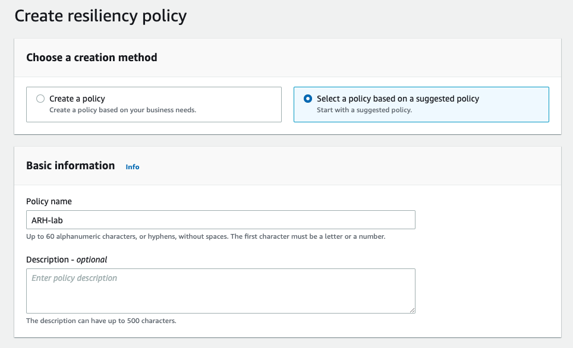
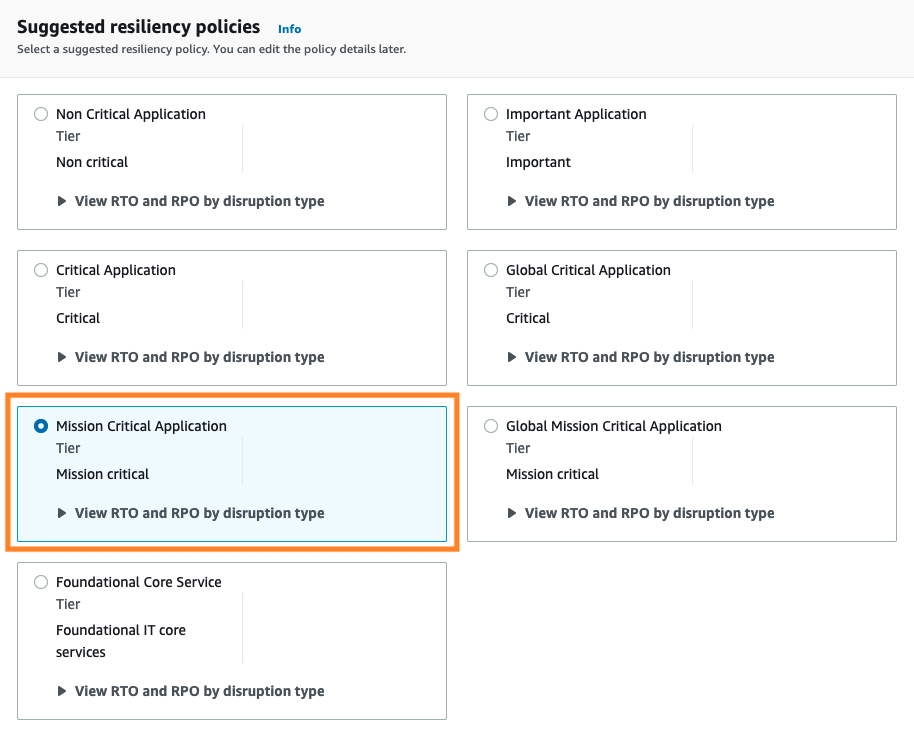
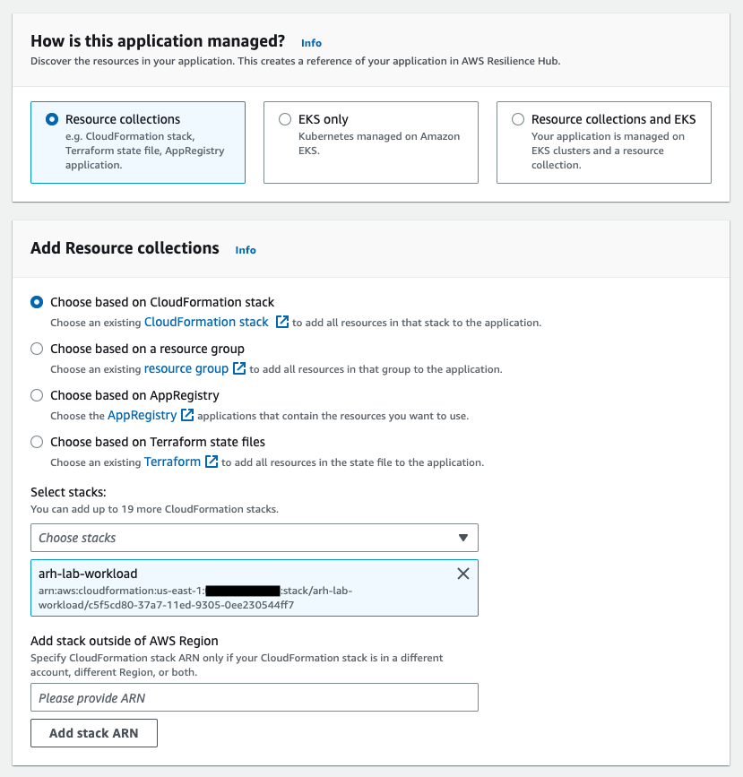
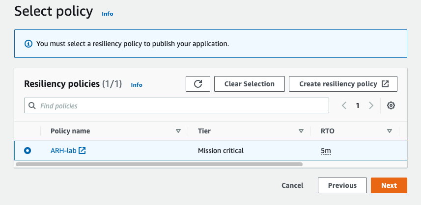
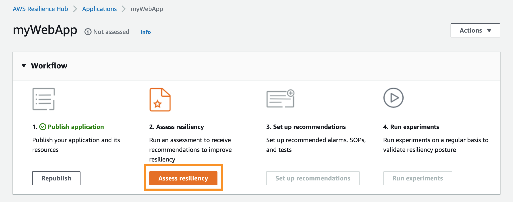
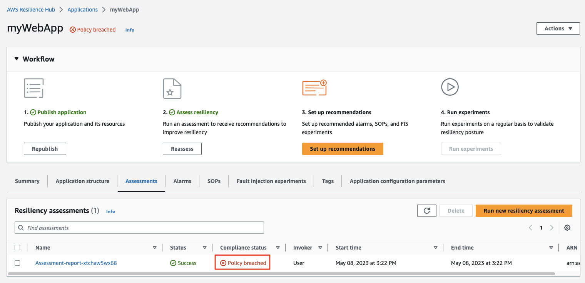

# [2. AWS Resilience Hub에 애플리케이션을 추가하고 평가]()

이제 워크로드가 배포되었으므로 Resilience Hub에 추가하고 복원력을 평가하는 방법을 살펴보겠습니다.

먼저 워크로드에 대한 복원력
목표(RTO/RPO)를 설명하는 복원력 정책을 만듭니다. 정책이 정의되면 새 애플리케이션을 만들어 Resilience Hub에 워크로드를 추가하고, 마지막으로 이 애플리케이션에 대해 복원력 평가를 실행합니다.

## [정책 설정]()

1.  [AWS Resilience Hub 콘솔](https://console.aws.amazon.com/resiliencehub/home)로 이동합니다.

2.  왼쪽 메뉴에서 **Policies**를 선택하고 해당 화면에서 **Create resiliency policy**을 클릭합니다.

3.  **Select a policy based on a suggested policy (제안된 정책에 따라 정책 선택)** 라디오 버튼을 선택하고 정책 이름에 아래 값을 입력합니다.   
```
ARH-lab
```
RTO/RPO 대상에 따라 사용자 지정 정책을 만들 수도 있지만 이 실습의 범위를 벗어납니다.<br>


4.  **"Suggested resiliency policies"** 섹션에서 **"Mission Critical Application"** 을 선택합니다. 드롭다운을 열어 다양한 [중단 유형](https://docs.aws.amazon.com/resilience-hub/latest/userguide/concepts-terms.html#disruption)에 대한 RTO 및 RPO가 정책에서 사용되는 것을 확인할 수 있습니다. 이러한 주제에 대한 자세한 내용은 [재해 복구 백서의 BCP(비즈니스 연속성 계획) 섹션](https://docs.aws.amazon.com/whitepapers/latest/disaster-recovery-workloads-on-aws/business-continuity-plan-bcp.html)에서 확인할 수 있습니다.<br>


5.  **Create**를 클릭합니다. 이렇게 하면 응용 프로그램과 연결할 수 있는 복원력 정책이 만들어지고 응용 프로그램에 대한 복원력 목표가 정의됩니다.

## [어플리케이션 추가]()

1.  [Resilience Hub 콘솔](https://console.aws.amazon.com/resiliencehub/) 의 주 메뉴로 돌아가서 **Applications > Add application**을 선택합니다.

2.  응용 프로그램 이름으로 다음을 입력합니다.
```
myWebApp
```

3.  **"How is this application managed?"** 를 클릭하고 **"Resource collections"** 을 선택한 다음 **"Add Resource collections"** 밑의 **"Choose based on CloudFormation stack"** 을 선택합니다.

4.  **"Select stacks"** 에서 **arh-lab-workload**를 선택합니다. Resilience Hub는 CloudFormation 스택 외에도 리소스 그룹, AppRegistry, Terraform 상태 파일, EKS 클러스터 및 Resilience Hub 내에 정의된 기존 애플리케이션으로부터 [리소스 가져오기](https://docs.aws.amazon.com/resilience-hub/latest/userguide/discover-structure.html)를 지원합니다.<br>


5.  **"Scheduled assessment"** 에서 예약된 평가를 비활성화 시키기 위해 **"Active"** 상태를 토클하여 **"Disable"**로 토글합니다. 이 작업은 현재 실습에서만 사용하지 않도록 설정되었으며 프로덕션 워크로드에 대해서는 사용하도록 설정하는 것이 좋습니다. **Next**를 클릭합니다

6.  **"Identify resource"** 페이지에서 복원력 평가에서 제외할 리소스를 선택할 수 있습니다. 이 워크숍에서는 모든 리소스를 포함합니다 . 이러한 리소스는 **arh-lab-workload** CloudFormation 스택의 일부로 생성된 것과 동일한 리소스입니다. **Next**를 클릭합니다.<br>


7.  그런 다음 **"Select policy"** 페이지에서 이전에 만든 **ARH-lab** 정책을 선택하고 **Next**를 클릭합니다.<br>


8.  마지막 페이지는 검토 페이지이며, 세부 정보를 확인한 후 **"Publish"** 를 선택합니다.

## [워크로드 복원력 평가]()

응용 프로그램이 게시되면 응용 프로그램에 대해 Resilience Hub에서 워크플로 단계를 기록해 둡니다.<br>


1.  **"Assess resiliency"** 를 클릭하고 보고서 이름을 입력한 다음 **"Run"** 을 수행합니다. **Report name** 항목은 그대로 받아들여도 됩니다. 이제 Resilience Hub는 애플리케이션의 복원력을 평가하고 복원력 정책을 만들 때 정의된 대상과 비교합니다.

2.  그런 다음 **"Assessments"** 탭이 자동으로 선택되어야 하며, **Success**로 이동하기 전에 상태가 잠시 **Pending**으로 변하는 것을 볼 수 있습니다.

3.  평가가 완료되고 상태가 성공 (**Success**)으로 변경되면 보고서의 준수 상태 (**Compliance status**)를 확인합니다. 정책 위반 (**Policy breach**)가 있음을 알 수 있습니다.

평가를 완료한 후 Resilience Hub는 복원력 목표를 현재 아키텍처로 충족할 수 없다고 결정했습니다. 즉, 인시던트가 발생하는 경우 평가에 사용되는 정책에 정의된 <u>***RTO 및 RPO 내에서***</u> 애플리케이션을 복구할 수 없습니다 .
계속 진행하기 전에 아키텍처가 어떻게 이 문제를 일으켰는지 생각해 보십시오.<br>


<hr>

## [[이전]](./1-Deploy-the-Workload.md) | [[다음]](./3-Resilience-Findings-and-Recommendations.md)

