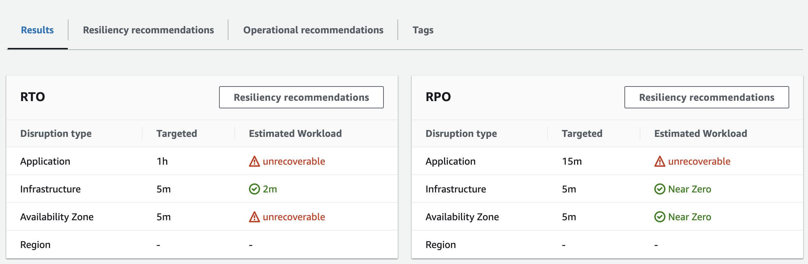
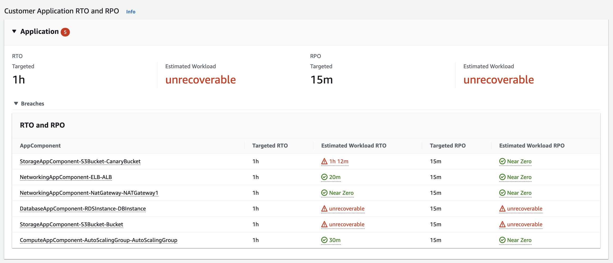
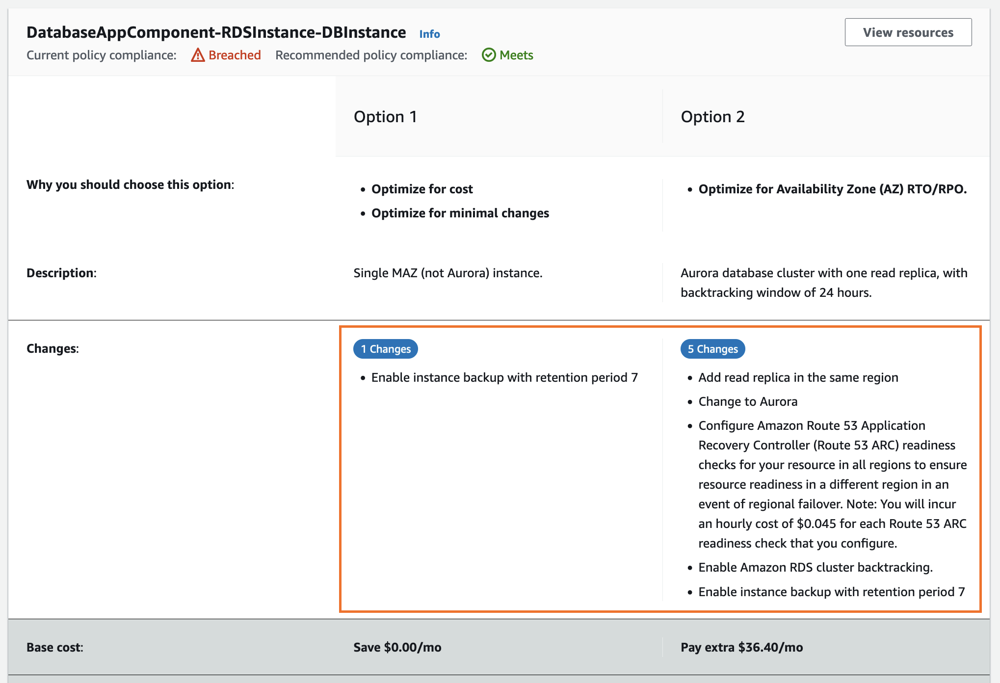
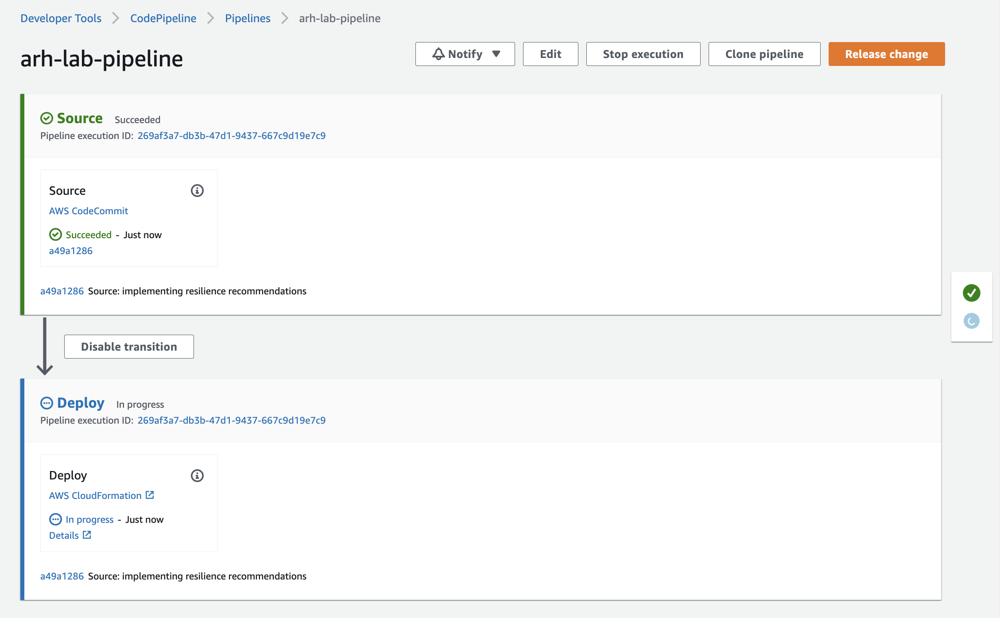
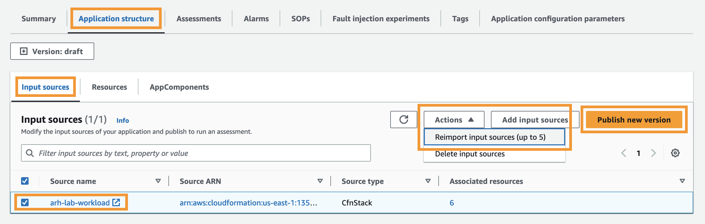
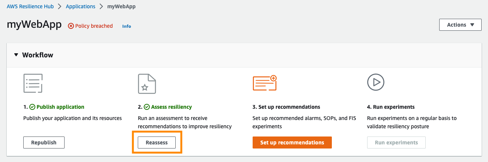
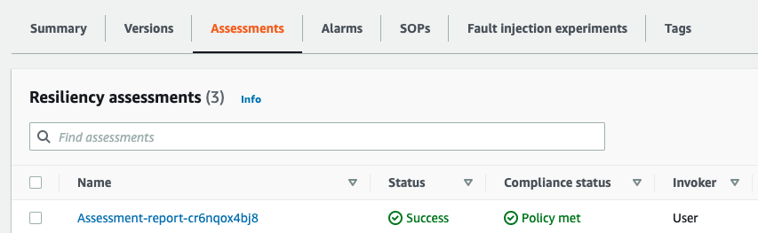
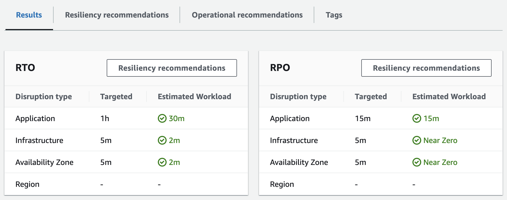
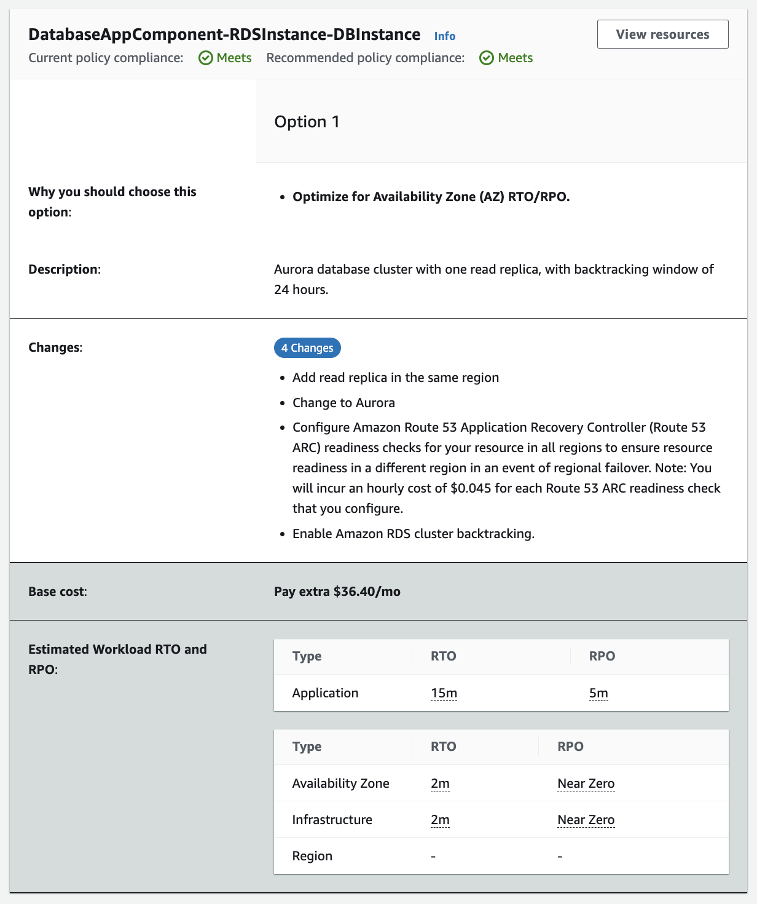
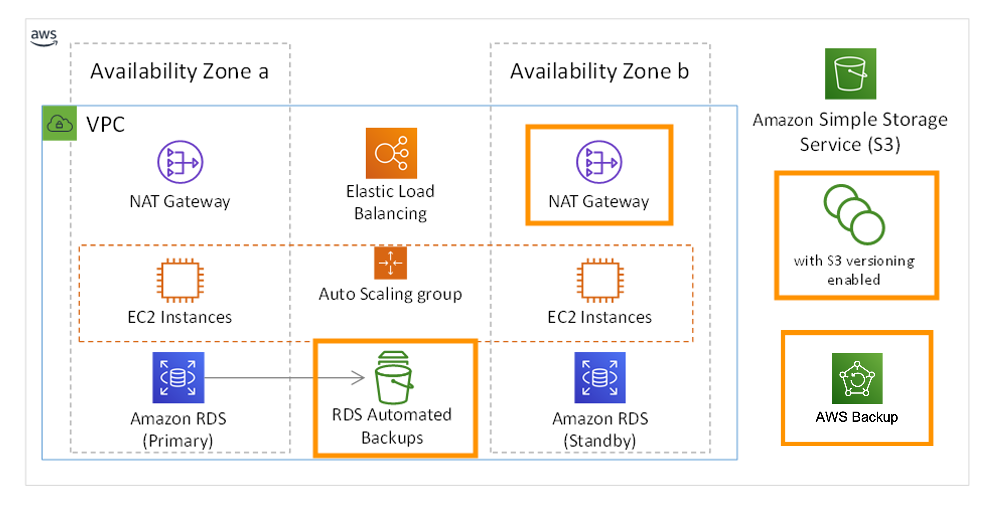

# 3. 복원력 발견 항목 및 권장 사항

이 섹션에서는 Resilience Hub에서 제공하는 평가에 대해 자세히 알아보고 RTO 및 RPO 요구 사항을 충족하기 위해 워크로드 아키텍처를 개선할 수 있는 방법에 대한 몇 가지 권장 사항도 살펴봅니다.

## [결과](https://catalog.workshops.aws/aws-resilience-hub-lab/en-US/prepare-and-protect/3-resiliency-recommendations#results)

1.  평가 보고서 이름을 클릭하여 정책 위반에 대한 자세한 내용을 확장합니다.

2.  **Results** 탭에서 요약을 볼 수 있습니다. 또한 위반의 원인과 각 중단 유형에 대한 예상 RTO/RPO를 확인할 수 있습니다.


3.  서로 다른 각 **중단 유형**을 확장하여 현재 아키텍처 및 해당 구성  요소가 정의한 복원력 정책을 충족할 수 없는 이유에 대한 추가 정보 및 세부 정보를 확인합니다.

4.  예상 **RTO** 및 **예상 RPO** 아래의 값을 클릭합니다. Resilience Hub가 이 평가를 제공한 이유에 대한 정보를 찾을 수 있습니다. 이 워크로드의 복원력 상태를 더 잘 이해하려면 다음을 살펴보세요.


## [복원력 권장 사항](https://catalog.workshops.aws/aws-resilience-hub-lab/en-US/prepare-and-protect/3-resiliency-recommendations#resiliency-recommendations)

Resilience Hub는 애플리케이션의 복원력을 평가하는 것 외에도 만든 복원력 정책에 정의된 RTO/RPO 요구 사항을 충족하기 위해 아키텍처를 개선할 수 있는 방법에 대한 지침도 제공합니다.

1.  **"Resiliency recommendations"** 탭을 선택하고 **databaseappcomponent** 구성 요소를 선택합니다. Resilience Hub는 복원력 요구 사항을 충족하기 위해 취할 수 있는 권장 사항에 대한 옵션을 보여줍니다. 이러한 변경에는 관련 비용이 있으며 Resilience Hub는 **예상 비용**을 제공합니다. 다음은 데이터베이스 구성 요소에 대한 권장 사항입니다.


2.  다른 구성 요소에 대한 권장 사항을 살펴봅니다. Resilience Hub에서 제공하는 권장 사항은 [AWS Well-Architected Framework](https://aws.amazon.com/architecture/well-architected/)에 정의된 모범 사례와 일치합니다.

  
| **Well-Architected 모범 사례**                                                        | **아키텍처 수정**                                                               |
|-----------------------------------------------------------------------------------|---------------------------------------------------------------------------|
| [정상 리소스로 장애 조치 (Failover)](https://wa.aws.amazon.com/wat.question.REL_11.ko.html) | 하나의 가용 영역을 사용할 수 없게 되더라도 EC2 인스턴스는 두 번째 NAT 게이트웨이를 통해 아웃바운드 연결을 계속 유지합니다. |
| [백업해야 하는 모든 데이터 식별 및 백업](https://wa.aws.amazon.com/wat.question.REL_9.ko.html)    | RDS 데이터베이스의 데이터 및 S3 버킷이 백업됩니다.                                           |
| [자동으로 데이터 백업 수행](https://wa.aws.amazon.com/wat.question.REL_9.ko.html)            | RDS 백업은 자동입니다. S3 객체 버전 관리도 자동으로 수행됩니다. AWS Backup도 자동입니다.                                              |                  

## [워크로드 개선](https://catalog.workshops.aws/aws-resilience-hub-lab/en-US/prepare-and-protect/3-resiliency-recommendations#improving-the-workload)

단일 리전 내에서 응용 프로그램의 복원력을 높이는 데 필요한 변경 내용을 적용해 보겠습니다. Resilience Hub에서 만든 권장 사항을 구현하기 위해 템플릿을 업데이트하고 코드 리포지토리에 커밋합니다. 이렇게 하면 CodePipeline이 워크로드에 대한 CloudFormation 스택에 변경 사항을 전달하도록 트리거됩니다.

1.  [AWS Cloud9](https://console.aws.amazon.com/cloud9/home) 콘솔로 이동합니다.

2.  CodeCommit 리포지토리에 액세스할 수 있는 권한을 설정하려면 다음 명령을 실행합니다.
```
git config --global credential.helper '!aws codecommit credential-helper $@'
git config --global credential.UseHttpPath true
```

3.  다음 명령에서 [you\@example.com](mailto:you@example.com) 및 **"Your Name"** 부분을 자신의 정보로 바꾼 후 명령을 실행합니다.
```
git config --global user.email you@example.com
git config --global user.name "Your Name"
```

4.  다음 명령을 실행하여 코드 리포지토리를 복제합니다. **CLONE URL**의 값을 **arh-lab-pipeline** CloudFormation 스택의 [Outputs] 섹션에서 얻은 값으로 바꿉니다.
```
git clone <REPLACE WITH YOUR CLONE URL>
```

5. 다음 명령을 실행하여 코드가 포함된 디렉터리로 이동합니다.
```
cd arh-lab-repo
```
 
7. 다음 명령을 실행하여 CloudFormation 템플릿을 업데이트하고 Resilience Hub에서 권장하는 변경 사항을 구현합니다. 이 업데이트된 템플릿에 포함된 변경 사항은 <u>**RDS에 대한 자동 백업을 활성화하고, S3 버킷에 대해 Versionining 및 PITR(특정 시점으로 복구)을 사용하여 백업 계획을 활성화하고, 새 AZ에 두 번째 NAT 게이트웨이를 추가하는**</u> Resilience Hub의 권장 사항을 기반으로 합니다.
```
curl -o workload.yaml 'https://static.us-east-1.prod.workshops.aws/public/5a801e9b-1799-4eb6-90fe-6054bda3c7cc/static/resources/workload-updated.yaml'
```

7.  다음으로 이러한 변경 사항을 코드 리포지토리에 푸시해야 합니다. 이렇게 하려면 다음 명령을 실행합니다.
```
git commit -am "implementing resilience recommendations"
git push
```

8.  코드 리포지토리에 코드를 푸시하면 파이프라인이 자동으로 트리거되고 이러한 변경 내용이 배포됩니다. 파이프라인 실행 정보 및 CloudFormation 스택에 대한 업데이트는 각각 [CodePipeline 콘솔](https://ap-northeast-2.console.aws.amazon.com/codesuite/codepipeline/pipelines/arh-lab-pipeline/view?region=ap-northeast-2)과 [CloudFormation 콘솔](https://console.aws.amazon.com/cloudformation/home#/stacks?filteringStatus=active&filteringText=&viewNested=true&hideStacks=false) 로 이동하여 볼 수 있습니다.
    1. (참고) **UPDATE_COMPLETE 대기:** 계속하기 전에 CloudFormation 스택 상태가 **UPDATE_COMPLETE**로 변경될 때까지 기다립니다. RDS 변경으로 인해 최대 10분이 걸릴 수 있습니다.


## [응용 프로그램 재평가](https://catalog.workshops.aws/aws-resilience-hub-lab/en-US/prepare-and-protect/3-resiliency-recommendations#reassess-the-application)

1.  업데이트가 완료되면 애플리케이션의 [Resilience Hub 대시보드](https://console.aws.amazon.com/resiliencehub/home#/application/myWebApp/summary)로 돌아갑니다

2.  **"Application structure"** 탭을 선택한 다음 **Input sources** 탭을 선택합니다 . CloudFormation 스택을 변경했으므로 생성된 새 리소스를 Resilience Hub의 애플리케이션으로 다시 가져와야 합니다.

3.  **arh-lab-workload** 입력 소스를 선택하고 **Actions**를 클릭합니다. "**Reimport input sources**"를 클릭하여 CloudFormation
    스택 업데이트의 일부로 생성되었을 수 있는 새 리소스를 가져옵니다.

4.  이제 새 리소스를 가져왔으므로 업데이트된 아키텍처를 반영하는 새 버전의 응용 프로그램을 게시할 차례입니다. "**Publish new version**" 을 클릭한 다음 **Publish**를 클릭합니다. 페이지 맨 위에 다음 알림이 표시되어야 합니다 - **Successfully updated resources**. 이제 응용 프로그램이 Resilience Hub에서 업데이트되었습니다.


5.  워크플로 섹션에서 "**Reassess**" 선택하여 정책에 대해 어플리케이션의 복원력 새롭게 평가합니다.


6.  평가 상태가 **Success**로 변경되면 **Compliance status**(규정 준수 상태)가 **Policy met** (정책 충족)으로 표시됩니다.


7.  보고서를 클릭하면 추가 세부 정보를 볼 수 있습니다. 복원력 권장 사항 요약에는 다양한 **중단 유형에** 대한 **대상** 및 **예상** RPO 및 RTO 평가가 표시됩니다.


8.  마지막으로 복원력 권장 사항을 확인해 보겠습니다. databaseapp 구성 요소를 제외한 구성 요소에 대한 추가 권장 사항은 없습니다. 더 작은 RTO 및 RPO를 달성하기 위해 Resilience Hub는 Amazon Aurora 및 Backtracking을 사용함으로써 잠재적인 복원력 향상을 보여줍니다.
[참고 - Route 53 ARC (Application Recovery Controller)](https://aws.amazon.com/ko/blogs/korea/amazon-route-53-application-recovery-controller/)


그러나 현재 배포한 아키텍처는 여전히 Resilience Hub 내의 **복원력 정책**에서 설정한 기준을 *충족*합니다.

## [최종 아키텍처](https://catalog.workshops.aws/aws-resilience-hub-lab/en-US/prepare-and-protect/3-resiliency-recommendations#final-architecture)

Resilience Hub에서 제공하는 권장 사항을 구현하면 이 최종 아키텍처가 생성됩니다. 변경 사항은 위의 표에 설명된 것과 정확히 같습니다.



<hr>

## [[이전]](./2-Add-and-Assess-Application.md) | [[다음]](./4-Operational-Recommendations.md)
