[//]: # (# <span style="color:blue">4. 운영 권장 사항</span>)
# [4. 운영 권장 사항]()

복원력 권장 사항 외에도 Resilience Hub는 운영을 개선하는 방법에 대한 지침도 제공합니다. 운영 권장 사항에는 경보, 표준 운영 절차(SOP) 및 AWS Fault Injection Simulator 실험 설정에 대한 권장 사항이 포함되어 있습니다 (자세한 내용은 [여기](https://docs.aws.amazon.com/resilience-hub/latest/userguide/ops.reqs.html)를 참조). 이 섹션에서는 Resilience Hub에서 제공하는 운영 권장 사항을 검토하고 애플리케이션에 대해 구현할 수 있는 방법을 알아봅니다.

## [운영 권장 사항]()

1.  [AWS Resilience Hub 콘솔](https://console.aws.amazon.com/resiliencehub/home#/applications)로 이동합니다.

2.  **myWebApp** 응용 프로그램을 선택하고 평가 탭을 클릭한 다음 최신 평가 보고서를 엽니다.

3.  **Operational recommendations** 탭을 선택합니다. Resilience Hub는 다음과 같은 3가지 유형의 운영 지침을 제공합니다.
    -   [[경보]](https://docs.aws.amazon.com/resilience-hub/latest/userguide/alarms.html) - 애플리케이션의 상태를 모니터링하고 지정된 지표가 구성한 임계값에 도달하는 경우 경고하는 데 사용됩니다

    -   [[표준 운영 절차 (SOP)]](https://docs.aws.amazon.com/resilience-hub/latest/userguide/sops.html) - 가동 중단 또는 경보 발생 시 애플리케이션을 효율적으로 복구하도록 설계된 규범적 단계 집합입니다.

    -   [[오류 주입 실험 템플릿]](https://docs.aws.amazon.com/resilience-hub/latest/userguide/testing.html) - AWS 리소스의 중단을 시뮬레이션하여 애플리케이션의 복원력을 스트레스 테스트하도록 설계되었습니다.<br>

    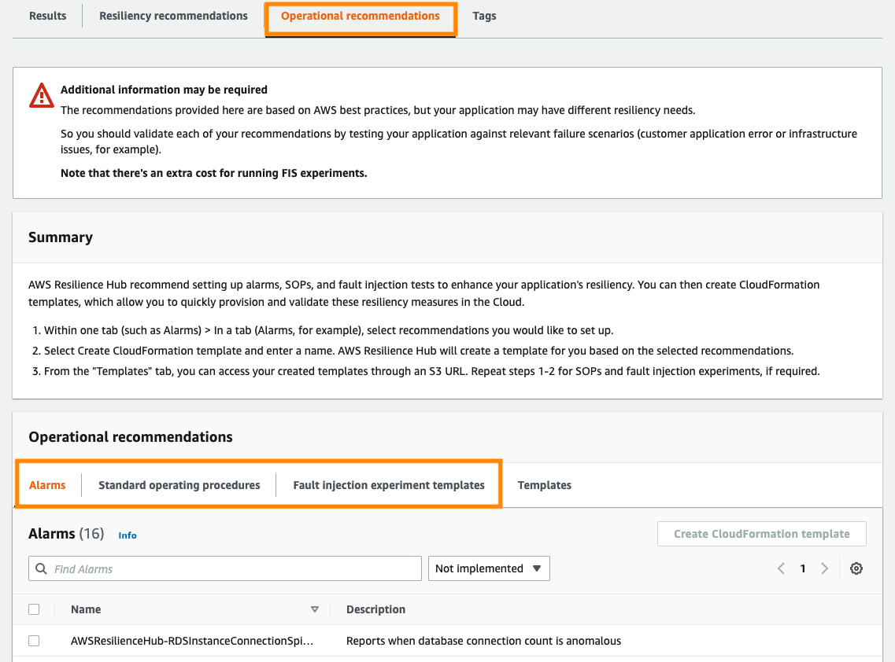

다음 섹션에서는 **알람 (Alarm)**, **표준 운영 절차 (Standard operating procedures)** 및 **오류 주입 실험 템플릿 (Fault injection experiment templates)** 권장 사항을 구현할 것입니다.

### [경보 (Alarms)]()

1.  **Alarms** 탭을 선택하여 Resilience Hub에서 권장하는 경보 목록을 확인합니다.

2.  **AWSResilienceHub-SyntheticCanaryInRegionAlarm_2021-04-01**과 같은 일부 경보에는 추가 구성이 필요합니다. 필수 구성 요소에 대한 세부 정보는 설정이 필요한 필요한 경보의 **Configuration**을 클릭하여 확인할 수 있습니다.

3.  이 실습에서는 다음 합성 카나리아 및 오토 스케일링 경보를 선택합니다. 프로덕션 워크로드에 대해서는 제안된 경보를 더 많이 혹은 모두 구현해야 할 수도 있습니다. 또한 워크로드에 대한 핵심 성과 지표(KPI) 역할을 하는 사용자 지정 지표를 기반으로 경보를 생성해야 합니다.
    -   AWSResilienceHub-SyntheticCanaryInRegionAlarm_2021-04-01
    -   AWSResilienceHub-AsgHighCpuUtilizationAlarm_2020-07-13<br>
    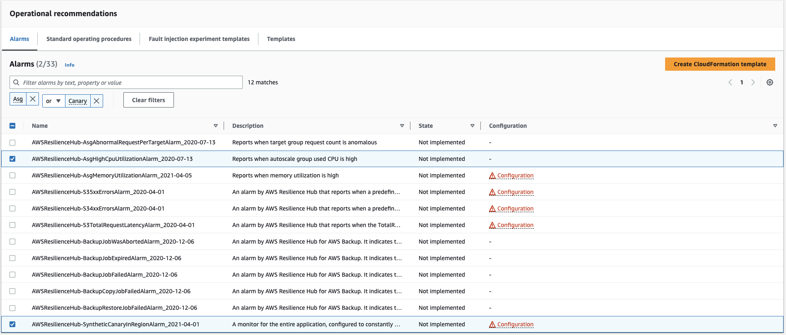

4.  Resilience Hub를 사용하면 CloudFormation 템플릿을 제공하여 이러한 모범 사례 경보를 쉽게 구현할 수 있습니다.**Create CloudFormation template**을 클릭하고 템플릿 이름에 아래를 입력하고 **Create**를 클릭합니다. 이러한 템플릿을 사용하는 방법은 랩의 이후 섹션에서 다룹니다.<br>
```
ARH-alarm
```
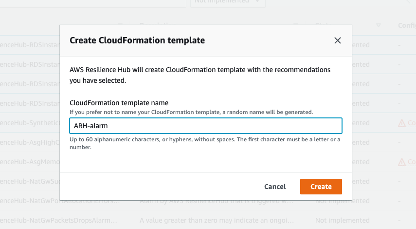

### [표준 운영 절차 (SOP)]()

1.  **Standard operating procedures** 탭을 선택하여 Resilience Hub에서 권장하는 SOP 목록을 확인합니다.

2.  SOP **AWSResilienceHub-ScaleOutAsgSOP_2020-07-01**을 선택합니다.<br>
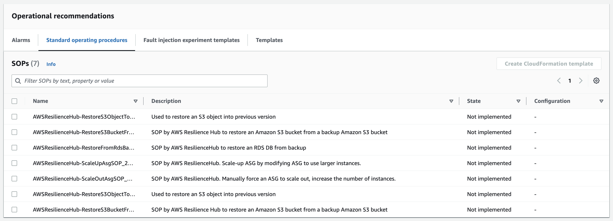

3.  **Create CloudFormation template**을 클릭하고 템플릿 이름에 아래를 입력한 후 **Create**를 클릭합니다. 이러한 템플릿을 사용하는 방법은 랩의 이후 섹션에서 다룹니다.<br>
```
ARH-sop
```
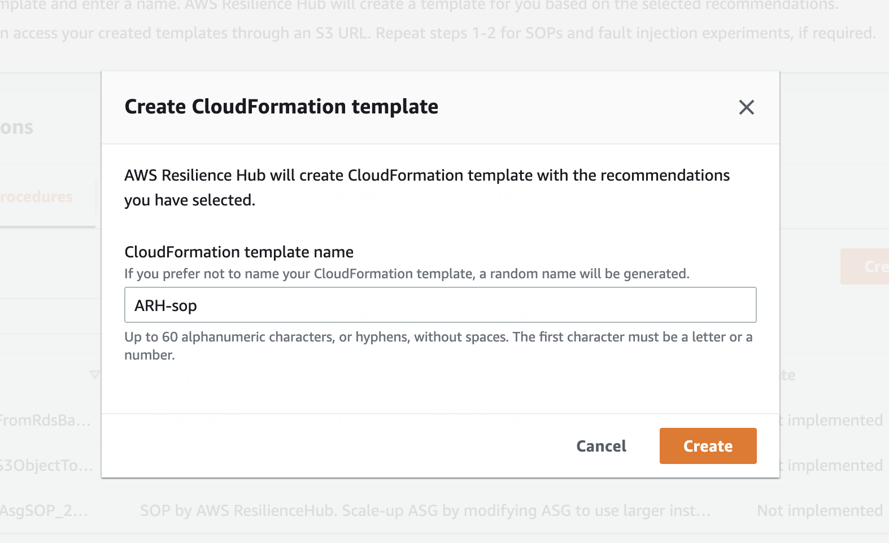

### [오류 주입 실험 템플릿]()

1.  **Fault injection experiment templates**을 선택하여 응용 프로그램에서 실행할 수 있는 오류 주입 실험 목록을 확인합니다.

2.  **AWSResilienceHub-InjectCpuLoadInAsgTest_2021-09-22**와 같은 일부 실험 템플릿에는 추가 구성이 필요합니다. 필수 구성 요소가 필요한 템플릿에 대한 구성을 클릭하여 필수 구성 요소에 대한 세부 정보를 찾을 수 있습니다.

3.  이 실습에서는 다음 실험 템플릿을 선택합니다. 실험 템플릿에 대한 설명은 수행하는 작업에 대한 정보를 제공합니다.
    -   AWSResilienceHub-FailoverRdsInstanceTest_2020-04-01
    -   AWSResilienceHub-InjectCpuLoadInAsgTest_2021-09-22<br>
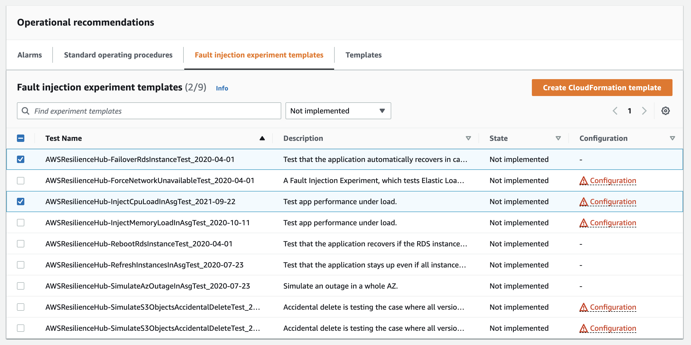

4.  **Create CloudFormation template**을 클릭하고 템플릿 이름에 아래 값을 입력합니다
```
ARH-fis
```
> **경보 종속성 (Alarm dependency)**
>
> Resilience Hub는 실험 (Experiment)를 생성하기 전에 FIS 실험에 필요한 경보가 생성되었는지 확인합니다. 이 작업은 이전 단계에서 수행되었으므로 (아직 배포는 되지 았았지만) **CloudFormation 템플릿 생성 (Create CloudFormation template)** 을
> 클릭하여 계속 진행합니다.

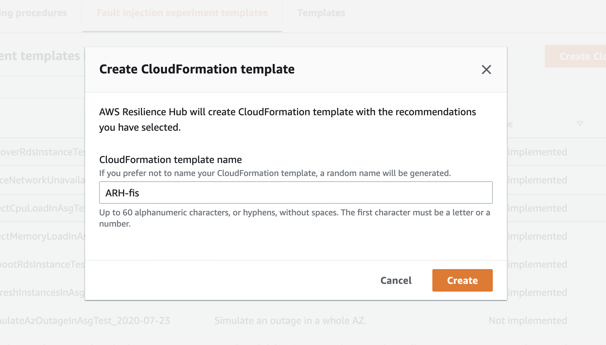

### [CloudFormation 템플릿 다운로드]()

이전 단원에서는 Resilience Hub에서 제공하는 목록에서 구현할 운영 권장 사항을 선택하고 이에 대한 CloudFormation 템플릿을 생성했습니다. 이제 Resilience Hub에서 생성된 템플릿을 배포하고 애플리케이션이 얻을 수 있는 이점에 대해 자세히 알아보겠습니다.

1.  **Operational recommendations (운영 권장 사항)** 에서 **Templates** 탭을 선택합니다. Resilience Hub에서 생성된 CloudFormation 템플릿 목록이 표시됩니다. **ARH-alarm** 템플릿을 클릭합니다.<br>
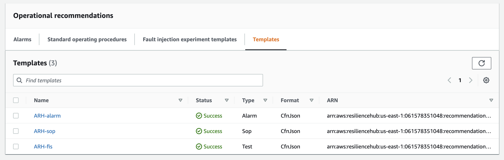

2.  ARH는 내구성과 액세스 편의성을 위해 CloudFormation 템플릿을 Amazon Simple Storage Service (S3)에 저장합니다. **Templates S3 Path** 아래의 링크를 클릭하여 템플릿이 저장된 S3 위치로 이동합니다.<br>
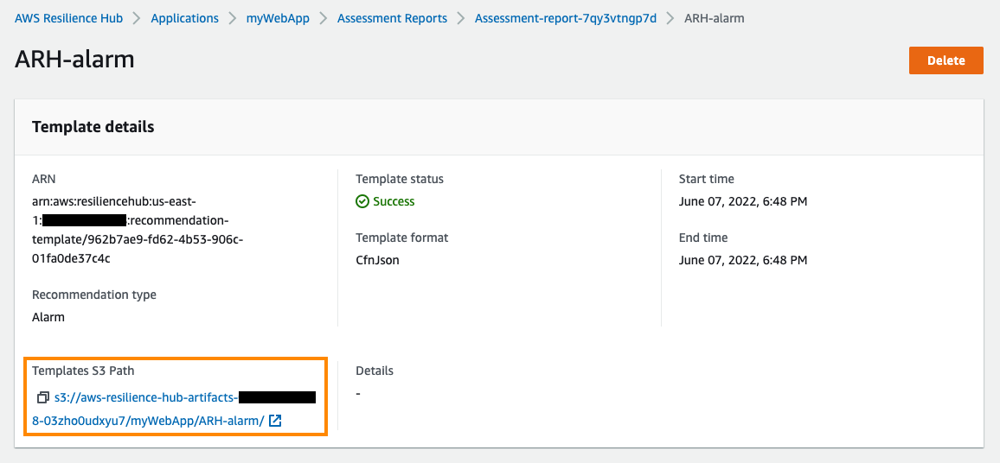

3.  템플릿이 생성된 권장 사항 유형에 따라 **alarm**, **sop** 또는 **test**라는 폴더가 표시되어야 합니다. 이것은 **ARH-alarm** 템플릿이므로 버킷에 **alarm**이라는 폴더가 표시되어야 합니다.<br>
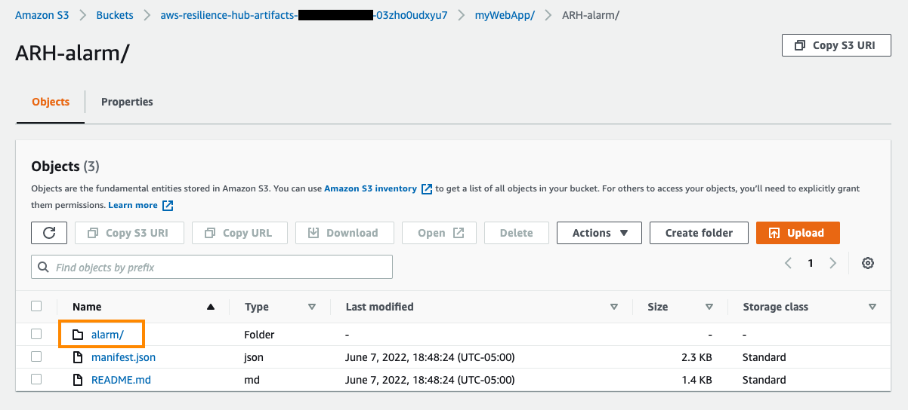

4.  **alarm** 폴더로 이동하면 CloudFormation 템플릿 (JSON 파일)이 표시됩니다.

5.  **Download(다운로드)** 를 클릭하여 템플릿 파일을 로컬 컴퓨터에 다운로드합니다.<br>


6.  **ARH-sop** 및 **ARH-fis** 템플릿에 대해 1-5단계를 반복합니다.

## [운영 권장 사항 구현]()

CloudFormation 템플릿은 워크로드에 운영 모범 사례를 구현하는 좋은 방법이며 사용자 지정이 가능합니다.

### [경보]()

1.  선호하는 텍스트 편집기에서 **ARH-alarm** 템플릿을 엽니다.

2.  "**AWSResilienceHubAsgHighCpuUtilizationAlarm**"으로 시작하는 리소스를 찾습니다. 이 리소스에 대해 "**EvaluationPeriods**" 및 "**DatapointsToAlarm**" 속성을 **(각각) 5와 3에서 1과 1로** 업데이트합니다. Resilience Hub에서 제공하는 템플릿은 훌륭한 시작점 역할을 하며, 워크로드에 사용하는 기존의 CloudFormation 템플릿과 사용자 지정 및 통합할 수 있습니다. 이 실습에서는 경보가 더 민감하도록 값을 업데이트하여 문제를 훨씬 더 빠르게 감지하여 실습의 다음 단계를 진행하기 전에 기다려야 하는 시간을 줄입니다. 새 코드 조각은 다음과 유사할 것입니다.
```json
"AWSResilienceHubAsgHighCpuUtilizationAlarm20200713arhlabworkloadAutoScalingGroup1T60EI9JPECJSAlarm" : {
  "Type" : "AWS::CloudWatch::Alarm",
  "Properties" : {
    "AlarmActions" : [ {
      "Ref" : "SNSTopicARN"
    } ],
    "AlarmDescription" : "Alarm by AWS Resilience Hub that reports when autoscale group CPU utilization is over 90%",
    "AlarmName" : "AWSResilienceHub-AsgHighCpuUtilizationAlarm-2020-07-13_myWebApp_arh-lab-workload-AutoScalingGroup-1T60EI9JPECJS",
    "ComparisonOperator" : "GreaterThanThreshold",
    "EvaluationPeriods" : 1,
    "DatapointsToAlarm" : 1,
    "Dimensions" : [ {
      "Name" : "AutoScalingGroupName",
      "Value" : "arh-lab-workload-AutoScalingGroup-1T60EI9JPECJS"
    } ],
    "MetricName" : "CPUUtilization",
    "Namespace" : "AWS/EC2",
    "Period" : 60,
    "Statistic" : "Average",
    "Threshold" : 90,
    "TreatMissingData" : "missing",
    "Unit" : "Percent"
  }
}
```
3. "**AWSResilienceHubSyntheticCanaryInRegionAlarm**"으로 시작하는 리소스를 찾습니다. 이 리소스의 경우 "**EvaluationPeriods**" 및 "**DatapointsToAlarm**" 속성을 **(각각) 3과 2에서 5와 5로** 업데이트합니다. 또한 "**Period**" 속성을 **60에서 120으로** 변경합니다. 이러한 변경으로 인해 카나리아 경보가 조기에 트리거되는 것을 방지하고 랩의 다음 단계를 계속할 수 있습니다. 이러한 값은 워크로드의 요구 사항에 따라 사용자 지정해야 합니다. 새 코드 조각은 다음과 같아야 합니다.
```json
"AWSResilienceHubSyntheticCanaryInRegionAlarm20210401useast1Alarm" : {
  "Type" : "AWS::CloudWatch::Alarm",
  "Properties" : {
    "AlarmActions" : [ {
      "Ref" : "SNSTopicARN"
    } ],
    "AlarmDescription" : "Alarm by AWS Resilience Hub that is triggered when synthetic canary SuccessPercent drops below 100%",
    "AlarmName" : "AWSResilienceHub-SyntheticCanaryInRegionAlarm-2021-04-01_update-4_us-east-1",
    "ComparisonOperator" : "LessThanThreshold",
    "EvaluationPeriods" : 5,
    "DatapointsToAlarm" : 5,
    "Dimensions" : [ {
      "Name" : "CanaryName",
      "Value" : {
        "Ref" : "CanaryName"
      }
    } ],
    "MetricName" : "SuccessPercent",
    "Namespace" : "CloudWatchSynthetics",
    "Period" : 120,
    "Statistic" : "Average",
    "Threshold" : 100,
    "TreatMissingData" : "missing",
    "Unit" : "Percent"
  }
}
```

4. 이러한 변경 내용을 파일에 저장하고 텍스트 편집기를 닫습니다.

5. [CloudFormation 콘솔](https://console.aws.amazon.com/cloudformation/home)로 이동하여 **Create Stack > With new resources (standard)** 를 클릭합니다.<br>


6. **Prepare template** > **Template is ready**를 선택하고, **Template source** 밑에서 **Upload a template file**을 선택합니다. 이전 섹션에서 다운로드하고 편집한 **ARH-alarm** 템플릿을 선택합니다.

7. 스택 이름에 다음을 입력합니다.
```
myWebApp-monitoring
```

8. SNS Topic ARN 파라미터에 **arh-lab-pipeline** 스택의 **Outputs** 섹션에서 표시되는 값을 입력하고, 카나리아 이름 (CanaryName)에는 **arh-lab-workload** 스택의 **Outputs** 섹션에서 얻은 값을 입력합니다.<br>
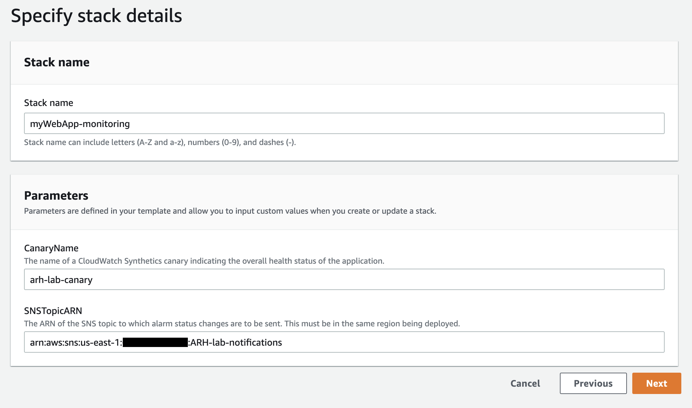

9. **Review (검토)** 페이지로 이동할 때까지 **Next**를 클릭하고 **Submit**을 클릭합니다.

> **CREATE_COMPLETE이 될 때까지 기다립니다**
>
> 계속하기 전에 CloudFormation 스택 상태가 **CREATE_COMPLETE**로 바뀔 때까지 기다립니다.

10. CloudFormation 콘솔로 돌아가 **myWebApp-Monitoring** 스택을 선택합니다 . **Resources** 탭을 클릭하고 "**AWSResilienceHubSyntheticCanaryInRegionAlarm20210401**"로 시작하는 논리적 ID를 찾습니다. 해당 Physical ID의 값을 복사합니다. 이 값은 다른 스택 (SOP)의 파라미터 값으로 사용됩니다.<br>
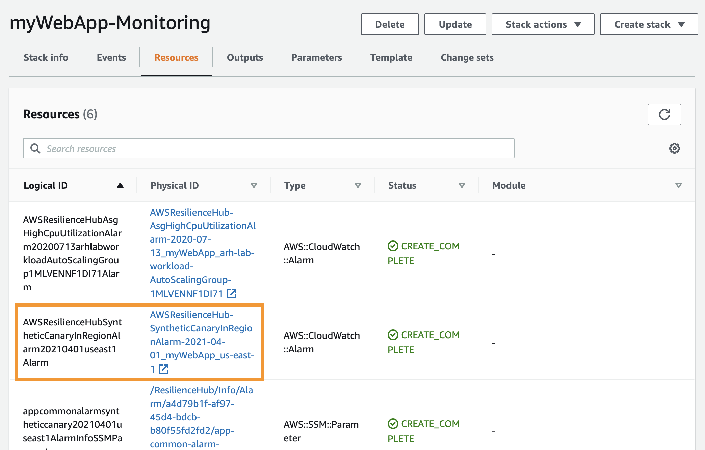

### [표준 운영 절차 (SOP)]()

1.  [CloudFormation 콘솔](https://console.aws.amazon.com/cloudformation/home) 로 이동하여 **Create Stack > With new resources (standard)** 를 클릭합니다.<br>


2.  **Prepare template** > **Template is ready**, **Template source** > **Upload a template file**을 각각 선택합니다. 이전 섹션에서 다운로드한 **ARH-sop** 템플릿을 선택합니다.

3.  스택 이름에 다음을 입력합니다.
```
myWebApp-SOP
```

4.  파라미터의 경우 이전 경보 (Alarm) 단원에서 생성한 **myWebApp-Monitoring** 스택의 **Resources** 탭에서 찾을 수 있는 카나리아 경보의 물리적 ID를 입력합니다 (논리적 ID **AWSResilienceHubSyntheticCanaryInRegionAlarm20210401**을 찾아 해당 물리 ID의 값을 복사).<br>
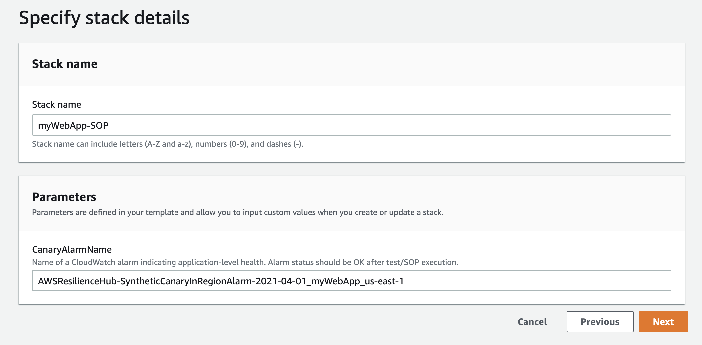

5.  **Review** 페이지로 이동할 때까지 **Next**를 클릭하고 **Submit**을 클릭합니다.

> **CREATE_COMPLETE이 될 때까지 기다립니다**
>
> 계속하기 전에 CloudFormation 스택 상태가 **CREATE_COMPLETE**로 바뀔 때까지 기다립니다.

6.  **Outputs** 탭을 클릭하고 **AWSResilienceHubAsgScaleOutAssumeRole**의 값을 복사합니다. 이 값은 이 Lab의 다음 스텝인 "5. Chaos Engineering with AWS Fault Injection Simulator"에서 사용됩니다.

### [오류 주입 실험]()

1.  선택한 텍스트 편집기에서 **ARH-fis** 템플릿을 엽니다.

2.  "**DurationSeconds**" 속성 (하나만 있음)을 검색하고 해당 값을 "**300에서 900으로**" 변경합니다. 이렇게 하면 실험이 5분이 아닌 15분 동안 실행되는데 워크로드의 요구 사항에 따라 사용자 지정해야 할 수 있습니다. 새 코드는 다음과 같습니다.

```json
"documentParameters" : {
            "Fn::Sub" : "{\"AutomationAssumeRole\": \"${AWSResilienceHubSimulateHighCpuLoadInAsgAssumeRole.Arn}\", \"AutoScalingGroupName\": \"arh-lab-workload-AutoScalingGroup-1MLVENNF1DI71\", \"CpuUtilizationAlarmName\": \"{{ssm:/ResilienceHub/Alarm/a4d79b1f-af97-45d4-bdcb-b80f55fd2fd2/compute-alarm-asg-cpu-util-2020-07-13_arh-lab-workload-AutoScalingGroup-1MLVENNF1DI71}}\", \"DurationSeconds\": \"900\", \"Cpu\": \"0\", \"LoadPercent\": \"100\", \"PercentageOfInstances\": \"70\", \"ExpectedRecoveryTime\": \"1\", \"IsRollback\": \"false\", \"PreviousExecutionId\": \"\"}"
          }
```

3.  이러한 변경 내용을 파일에 저장하고 텍스트 편집기를 닫습니다.

4.  [CloudFormation 콘솔](https://console.aws.amazon.com/cloudformation/home)로 이동하여 **Create Stack > With new resources (standard)** 클릭합니다.<br>


5.  **Prepare template** > **Template is ready**, **Template source** > **Upload a template file**을 각각 선택합니다. 이전 섹션에서 다운로드하고 편집한 **ARH-fis** 템플릿을 선택합니다.

6.  스택 이름에 다음을 입력합니다.
```
myWebApp-testing
```

7. 파라미터의 경우 이전 단원에서 **myWebApp-Monitoring** 스택의 **Resources** 탭에서 가져온 카나리아 경보의 물리적 ID를 입력합니다 (논리적 ID **AWSResilienceHubSyntheticCanaryInRegionAlarm20210401**을 찾아 해당 물리 ID의 값을 복사).<br>
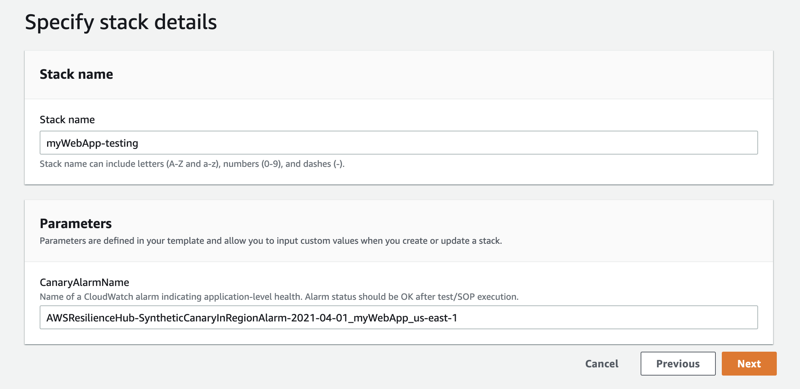

8.  **Review** 페이지로 이동할 때까지 **Next**를 클릭하고 **Submit**을 클릭합니다.

> **CREATE_COMPLETE이 될 때까지 기다립니다**
>
> 계속하기 전에 CloudFormation 스택 상태가 **CREATE_COMPLETE**로 바뀔 때까지 기다립니다.

다음 섹션에서는 일련의 테스트를 실행하여 복원력과 응용 프로그램의 운영 개선 사항을 확인합니다.

<hr>

## [[이전]](./3-Resilience-Findings-and-Recommendations.md) | [[다음]](./5-Chaos-Enginnering-with-AWS-Fault-Injection-Simulator.md)
