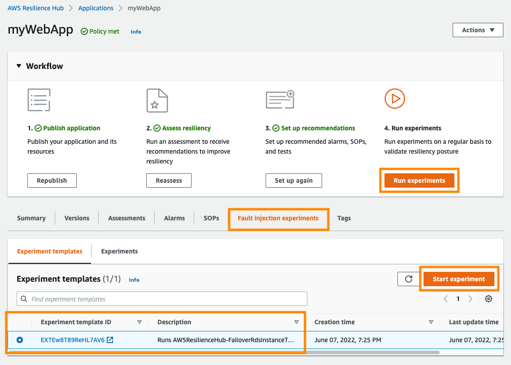
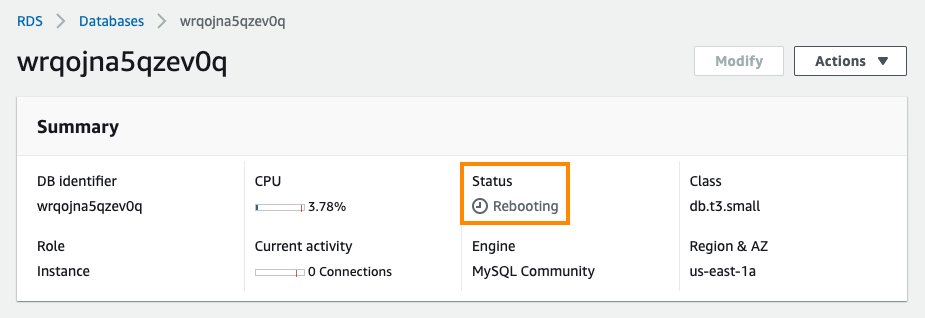
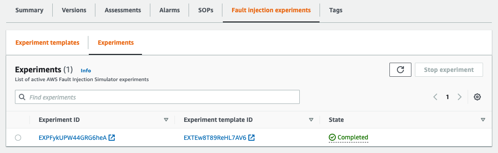
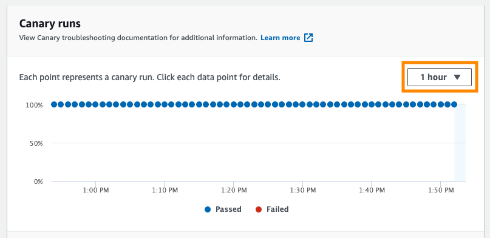
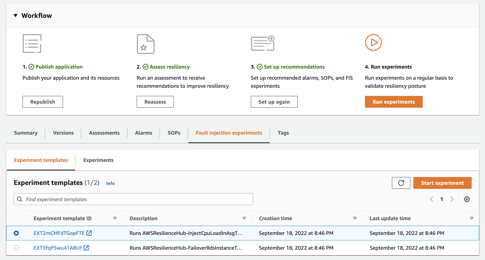
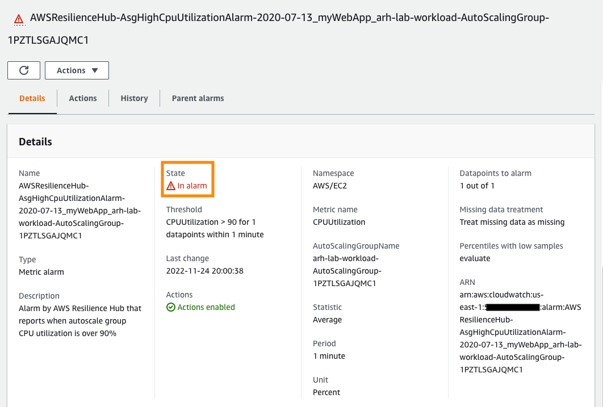
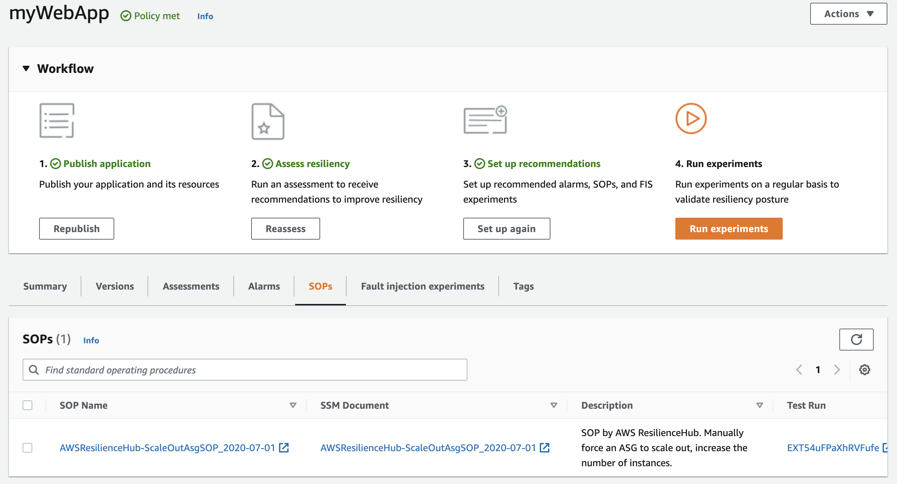
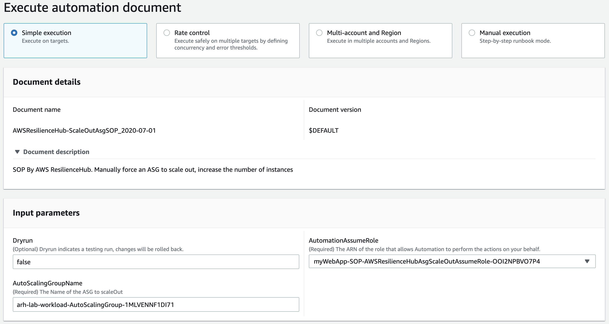

# 5. AWS Fault Injection Simulator를 사용한 카오스 엔지니어링

카오스 엔지니어링은 운영 환경에서 발생할 수 있는 거친 조건을 견딜 수 있는 시스템의 능력에 대해 확신을 구축하기 위해, 결함을 시뮬레이션하여 시스템을 실험하는 분야 (Discipline)입니다. Resilience Hub를 통해 애플리케이션의 복원력을 이해하고 개선할 수 있는 방법을 찾을 수 있으며, 한편 카오스 엔지니어링은 오류에 대한 애플리케이션의 응답을 볼 수 있으므로 시스템에 대한 확신을 높여 줍니다. 이 단원에서는 [AWS Fault Injection Simulator](https://aws.amazon.com/fis/)를 사용하여 애플리케이션에 오류를 주입해 보도록 합니다.

## 오류 주입

워크로드에 대해 두 가지 다른 테스트를 수행합니다.

1.  RDS 데이터베이스의 장애 이전 (failover) 강제 적용

2.  AutoScaling 그룹에 CPU 스트레스 주입

### RDS 장애 조치 (failover)

1.  [Resilience Hub 콘솔](https://console.aws.amazon.com/resiliencehub/home#/applications)로 이동하여 **myWebApp** 애플리케이션을 선택합니다.

2.  **Workflow**에서 **Run experiments**를 클릭합니다. 그러면 **Fault injection experiments** 탭으로 이동하며 , 여기서 이전
    단원에서 CloudFormation을 사용하여 생성한 FIS 실험 템플릿을 볼 수 있습니다.

3.  설명에 **AWSResilienceHub-FailoverRdsInstanceTest_2020-04-01**이 포함된 실험 템플릿을 선택합니다 . **Description**을 읽고 실험이 무엇인지 이해할 수 있습니다.

4.  **Start experiment** 클릭하고 확인하여 실험을 시작합니다.

5.  **Experiments** 탭이 자동으로 선택되고 실험이 **Initiating**로 표시됩니다. 몇 초 후에 **Running**으로 변경되며, 몇 분 후에는 **Completed**로 변경됩니다. 실행 중인 실험은 기본 인스턴스 또는 가용 영역의 중단을 시뮬레이션하여 RDS 데이터베이스가 보조 인스턴스로 장애 조치되도록 강제합니다. 이는 내부적으로 [RebootDBInstance API 호출](https://docs.aws.amazon.com/AmazonRDS/latest/APIReference/API_RebootDBInstance.html)을 실행하고 장애 조치(failover)를 강제로 수행하여 오류를 시뮬레이션합니다.

6.  [RDS 콘솔](https://console.aws.amazon.com/rds/home)로 이동하여 이 워크숍의 일부로 생성된 데이터베이스 인스턴스를 선택합니다. **Status**가 **Rebooting**인 것을 볼 수 있습니다. **Logs & events** 탭을 클릭하고 **Recent events** 섹션까지 아래로 스크롤 하여 데이터베이스가 재부팅되었는지 확인할 수도 있습니다.

7.  실험이 **Completed**가 될 때까지 기다립니다.

8.  **arh-lab-canary**에 대한 [CloudWatch Synthetics Canaries 콘솔]](https://console.aws.amazon.com/cloudwatch/home#synthetics:canary/detail/arh-lab-canary)로 이동합니다. 이것은 어플리케이션으로 주기적으로 요청을 보내고 도달 가능한지 확인하여 애플리케이션 엔드포인트를 모니터링해 온 Synthetics 카나리아입니다.

9.  **Canary runs** 실행 데이터를 관찰하여 FIS 실험이 실행 중일 때 애플리케이션 중단이 있었는지 확인합니다 (기간을 1시간으로 변경하고 마지막 10개의 데이터 요소 확인). 그래프가 업데이트될 때까지 몇 분 정도 기다려야 할 수 있습니다.

10. 실험이 실행되는 동안 응용 프로그램이 중단되었나요? 중단이 발생한 경우 애플리케이션이 5분의 RTO 내에 복구되었습니까?

### 오토스케일링 CPU 스트레스

1.  [Resilience Hub 콘솔](https://console.aws.amazon.com/resiliencehub/home#/applications)로 이동하여 **myWebApp** 애플리케이션을 선택합니다.

2.  **Workflow**에서 **Run experiments** 클릭합니다. 그러면 **Fault injection experiments** 실험 탭으로 이동하며 , 여기서 이전 섹션에서 만든 FIS 실험 템플릿을 볼 수 있습니다.

3.  설명에 **AWSResilienceHub-InjectCpuLoadInAsgTest_2021-09-22**가 포함된 실험 템플릿을 선택합니다. 이는 이전 단원에서
    CloudFormation을 사용하여 생성되었습니다. **Description** 읽고 실험이 무엇인지 파악할 수 있습니다.

4.  **Start experiment**를 클릭하고 실험을 시작합니다.

5.  **Experiments** 탭이 자동으로 선택되고 실험이 **Initiating**로 표시됩니다. 몇 초 후에 **Running**으로 변경됩니다. 실행 중인 실험은 Autoscaling 그룹의 인스턴스에 CPU 부하를 생성합니다. 이것은 내부적으로 stress-ng를 사용하여 CPU 부하를 생성하는 AWS Systems Manager 자동화 문서를 실행하고 있습니다.

6.  [CloudWatch 콘솔]](https://console.aws.amazon.com/cloudwatch/home#alarmsV2:alarm/)로 이동하고 **AWSResilienceHub-AsgHighCpuUtilizationAlarm-2020-07-13** 경보를 선택하여 상태를 확인합니다. 몇 분 안에 경보 상태가 되는 것을 볼 수 있습니다. 여기에는 이메일에 대한 이메일 알림도 함께 제공됩니다 (받은 편지함으로의 실제 배달은 여러 가지 이유로 지연될 수 있음).

7.  이 부하를 완화하기 위해 이전 섹션에서 만든 SOP를 실행합니다.

8.  [Resilience Hub 콘솔]](https://console.aws.amazon.com/resiliencehub/home#/applications)로 이동하여 **myWebApp** 애플리케이션을 선택합니다.

9.  **SOPs** 탭을 클릭하고 **AWSResilienceHub-ScaleOutAsgSOP_2020-07-01** SOP를 클릭합니다. 그러면 Systems Manager 콘솔로 이동합니다.

10. **Execute automation**을 클릭하면 새 탭이 열립니다.

11. **Input Parameters**에 다음 값을 입력합니다.
    -   Dryrun - false
    -   AutomationAssumeRole - (이전 스텝 복사해 둔) myWebApp-SOP 스택의 **Outputs** 탭에서 가져온 ARN을 입력합니다
    -   AutoScalingGroupName - arh-lab-workload 스택의 출력 탭에서 가져온 오토스케일링의 이름을 입력합니다.

12. **Execute**를 클릭합니다. 그러면 AutoScaling 그룹의 현재 용량을 평가하고 용량을 추가하도록 업데이트하는 Systems Manager 문서가 실행됩니다.

13. SOP/Systems Manager 문서의 실행이 완료되면 [AutoScaling 콘솔](https://console.aws.amazon.com/ec2/home#AutoScalingGroups:)로 이동하여 업데이트된 용량(최대)을 확인합니다.

14. [CloudWatch 콘솔](https://console.aws.amazon.com/cloudwatch/home#alarmsV2:alarm/)로 이동하고 **AWSResilienceHub-AsgHighCpuUtilizationAlarm-2020-07-13** 경보를 선택하여 상태를 확인합니다. 이제 OK 상태임을 알 수 있습니다. 또한 **arh-lab-canary**에 대한 [**[Canary runs]**](https://console.aws.amazon.com/cloudwatch/home#synthetics:canary/detail/arh-lab-canary) 실행 데이터를 검토 하여 FIS 실험이 실행 중일 때 애플리케이션 중단이 있었는지 확인할 수 있습니다(기간을 1시간으로 변경하고 마지막 10개의 데이터 포인트 확인). 그래프가 업데이트될 때까지 몇 분 정도 기다려야 할 수 있습니다.

15. [Resilience Hub 콘솔](https://console.aws.amazon.com/resiliencehub/home#/applications)로 이동하여 **myWebApp** 애플리케이션을 선택합니다. ** Fault injection experiments** 실험 탭을 선택한 다음 **Experiments** 탭을 선택합니다. 실험은 여전히 실행 중이지만 애플리케이션은 더 이상 영향을 받지 않습니다(경보가 OK 상태인 것으로 입증됨).

> 다음 섹션을 계속 진행합니다
>
> 실험이 완료될 때까지 기다릴 필요가 없습니다. "6. 복원력 검사를 CICD 파이프라인에 통합"으로 진행하여도 됩니다.

SOP를 사용하고 용량을 늘림으로써 시뮬레이션된 장애의 영향을 완화할 수 있었습니다.

## [[이전]](./4-Operational-Recommendations.md) | [[다음]](./6-Integrate-Resilience-Checks-into-CICD-Pipelines.md)
