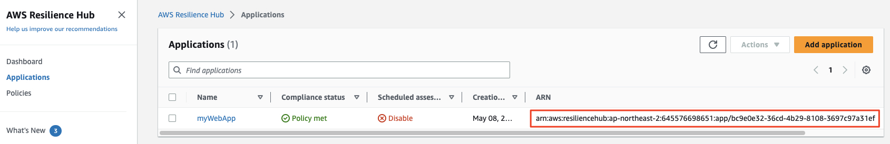
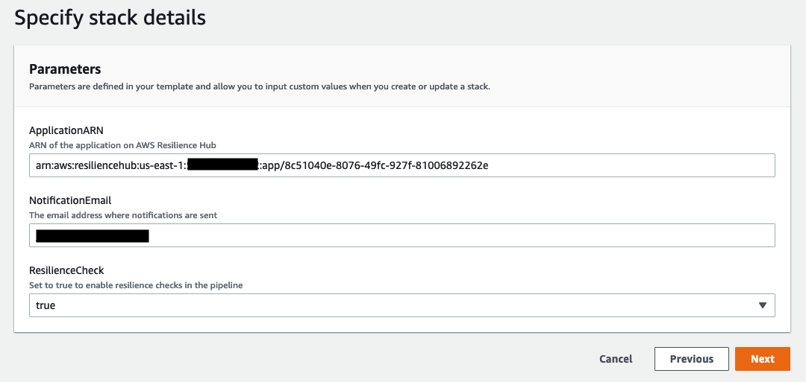
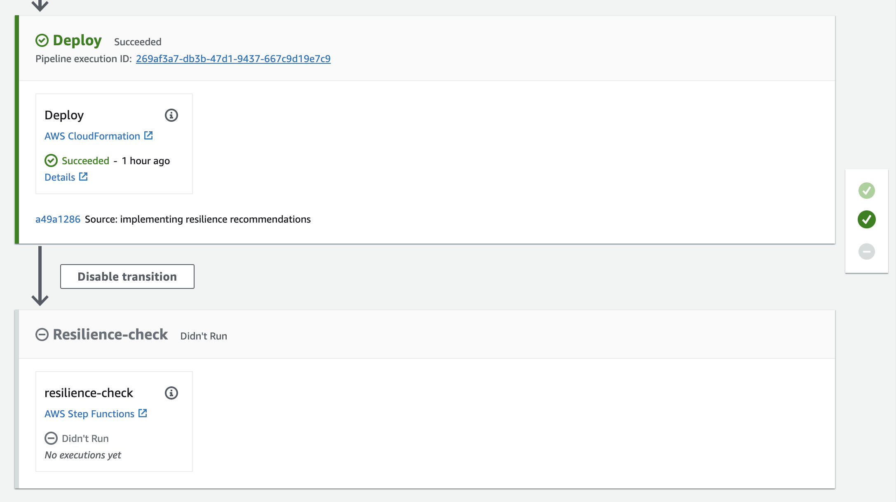
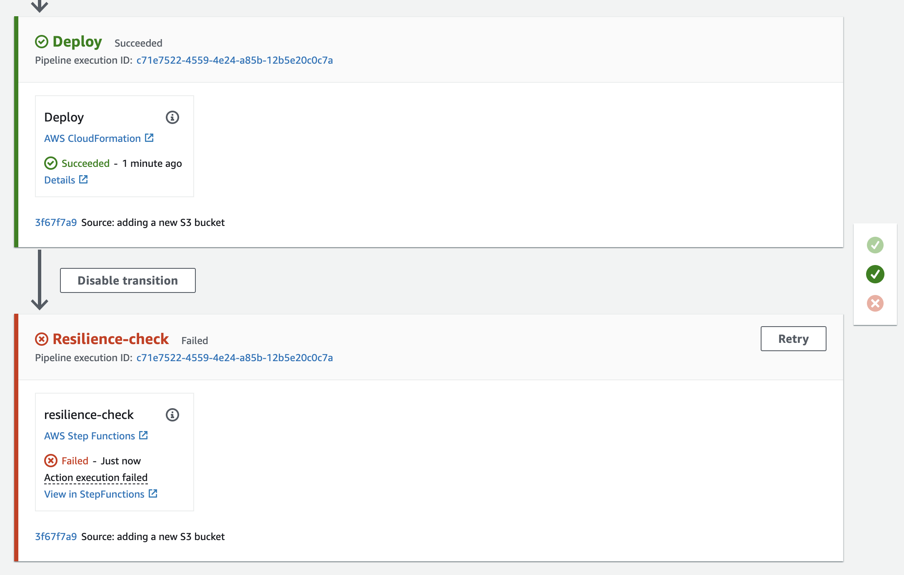
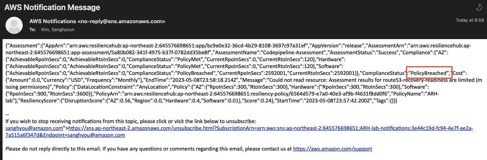
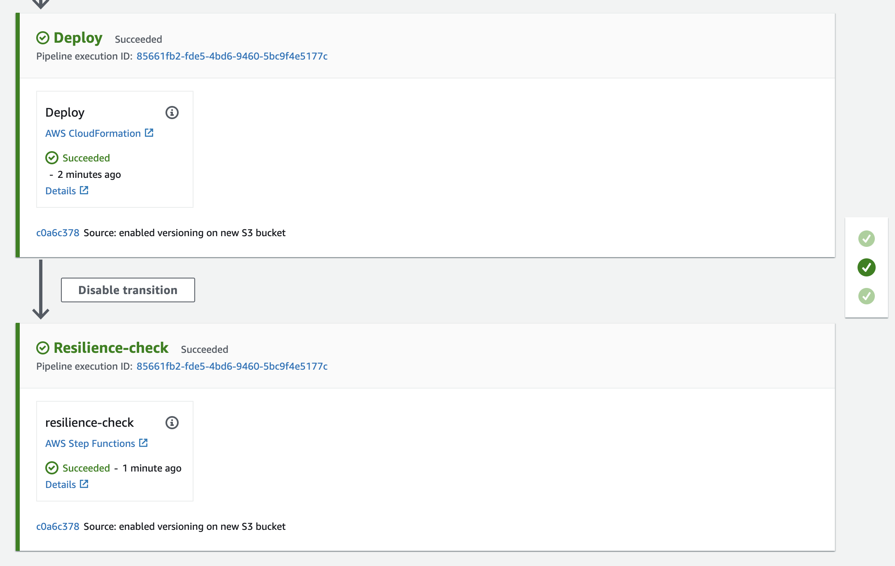

# [6. 복원력 검사를 CICD 파이프라인에 통합]()

CI/CD(지속적인 통합 및 지속적인 전달)는 최종 사용자에게 새로운 애플리케이션 기능을 신속하게 제공하는 데 사용되는 일반적인 모범 사례입니다. 이 개념은 또 다른 모범 사례인 IaC(Infrastructure as Code)를 사용할 때도 인프라에 적용됩니다. 이 섹션에서는 Resilience Hub 및 해당 복원력 검사를 CI/CD 프로세스에 통합하여 잠재적인 복원력 위험이 프로덕션 환경에 도입되는 것을 방지하는 방법을 살펴봅니다.

## [파이프라인에 복원력 검사 추가]()

1.  [CloudFormation 콘솔](https://console.aws.amazon.com/cloudformation/home)로 이동하여 **arh-lab-pipeline** 스택을 선택합니다.

2.  **Update**를 클릭합니다. **Prerequisite - Prepare template**에 대한 변경은 필요하지 않으므로 그대로 두고 **Next**를 클릭합니다.

3.  parameters 섹션에서 다음 값을 입력합니다.
    -   ApplicationARN - Resilience Hub 내에 정의된 애플리케이션의 ARN을 붙여넣습니다. 이 값은 [Resilience Hub 콘솔](https://console.aws.amazon.com/resiliencehub/home#/applications) 의 ARN 열 아래에서 찾을 수 있습니다.<br>
    
    -   ResilienceCheck - 이 값을 true로 변경합니다.
    

4.  **Next**를 클릭하여 검토 페이지로 이동합니다. **"I acknowledge that AWS CloudFormation might create IAM resources with custom names."** 확인란을 선택하고 **Submit**을 클릭합니다.

> **UPDATE_COMPLETE 대기**
>
> 계속하기 전에 CloudFormation 스택 상태가 **UPDATE_COMPLETE**로 바뀔 때까지 기다립니다.

5.  [CodePipeline 콘솔](https://ap-northeast-2.console.aws.amazon.com/codesuite/codepipeline/pipelines/arh-lab-pipeline/view?region=ap-northeast-2) 로 이동하여 **Resilience-check**라는 새 단계가 추가되었는지 확인합니다.


## [인프라 변경 배포]()

Resilience Hub를 CI/CD 파이프라인에 통합했으므로 이제 워크로드 인프라를 업데이트하여 테스트할 차례입니다.

1.  [AWS Cloud9](https://console.aws.amazon.com/cloud9/home) 콘솔로 이동합니다.

2.  다음 명령을 실행하여 응용 프로그램의 작업 디렉터리를 전환합니다.
```shell
cd arh-lab-repo
```

3.  워크로드에 새 S3 버킷을 추가해 보겠습니다. 다음 명령을 실행하여 워크로드에 대한 업데이트된 템플릿을 만듭니다.
```shell
curl -o workload.yaml 'https://static.us-east-1.prod.workshops.aws/public/5a801e9b-1799-4eb6-90fe-6054bda3c7cc/static/resources/workload-new-bucket.yaml'
```

4.  이러한 변경 사항을 커밋하고 코드 리포지토리에 푸시하여 CodePipeline 배포를 트리거합니다.
```shell
git commit -am "adding a new S3 bucket"
git push
```

5. [CodePipeline 콘솔](https://ap-northeast-2.console.aws.amazon.com/codesuite/codepipeline/pipelines/arh-lab-pipeline/view?region=ap-northeast-2)로 이동하여 파이프라인 실행이 진행 중인지 확인합니다.

6. 파이프라인은 **Resilience-check** 단계에서 실패할 것입니다. 이 실패에 대한 알림을 위해 이메일 (Lab 리소스 생성 시 NotificationEmail 매개 변수로 입력한 값)을 모니터링합니다. **ComplianceStatus**가 **PolicyBreached**라는 알림을 받아야 합니다.


> Policy Breached 이메일
> 
> 

7. [Resilience Hub 콘솔](https://console.aws.amazon.com/resiliencehub/home#/applications)로 이동하여 **myWebApp** 애플리케이션을 선택합니다.

8. **Assessments** 탭을 선택합니다. 알림 이메일과 마찬가지로 **Compliance status**가 **Policy breached**로 표시됩니다.

9. 보고서를 클릭하면 영향을 받는 중단 유형을 확인할 수 있습니다. 추가된 새 S3 버킷에 버전 관리가 활성화되어 있지 않거나 연속 백업이 구성되어 있지 않습니다. 즉, 해당 버킷에서 데이터를 삭제하면 복구할 수 없습니다.

Resilience Hub를 CI/CD 파이프라인에 통합함으로써 알림을 받을 수 있었고 잘못된 변경 사항이 프로덕션으로 유입되지 않도록 조치를 취할 수 있었습니다.

## [버킷 업데이트 및 재배포]()

새 S3 버킷에 대한 변경 사항을 구현하고, 버전 관리를 활성화하고, AWS Backup Plan의 연속 백업 구성을 위해 적절한 태그를 추가합니다. 그런 다음 이 변경 사항을 코드 리포지토리에 커밋하고 어떤 일이 발생하는지 관찰합니다.

1.  [AWS Cloud9](https://console.aws.amazon.com/cloud9/home) 콘솔로 이동합니다.

2.  다음 명령을 실행하여 응용 프로그램의 작업 디렉터리를 전환합니다.
```shell
cd arh-lab-repo
```

3.  RTO 및 RPO 요구 사항을 충족할 수 있도록 새 S3 버킷에 버전 관리를 추가해 보겠습니다.
```shell
curl -o workload.yaml 'https://static.us-east-1.prod.workshops.aws/public/5a801e9b-1799-4eb6-90fe-6054bda3c7cc/static/resources/workload-new-bucket-versioning.yaml'
```

4.  이러한 변경 사항을 커밋하고 코드 리포지토리에 푸시하여 CodePipeline 배포를 트리거합니다.
```shell
git commit -am "enabled versioning and pitr on new S3 bucket"
git push
```

5. [CodePipeline 콘솔](https://ap-northeast-2.console.aws.amazon.com/codesuite/codepipeline/pipelines/arh-lab-pipeline/view?region=ap-northeast-2)로 이동하여 파이프라인 실행이 진행 중인지 확인합니다.

6. 이제 워크로드가 RTO 및 RPO 요구 사항을 충족하므로 이번에는 파이프라인 실행이 성공적으로 완료되었는지 확인합니다.


7. [Resilience Hub 콘솔](https://console.aws.amazon.com/resiliencehub/home#/applications)의  **myWebApp** 응용 프로그램의 **Assessments** 탭을 방문하여 이를 확인할 수도 있습니다.

<hr>

## [[이전]](./5-Chaos-Enginnering-with-AWS-Fault-Injection-Simulator.md) | [[다음]](./7-Lab-Clean-up.md)
