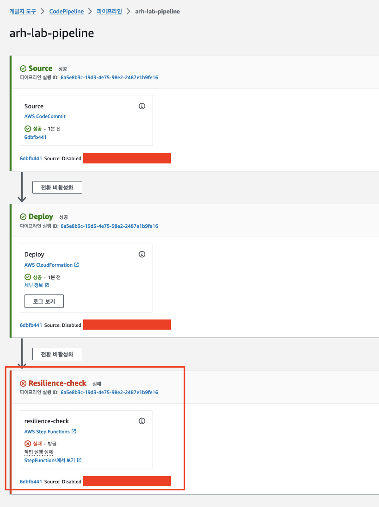
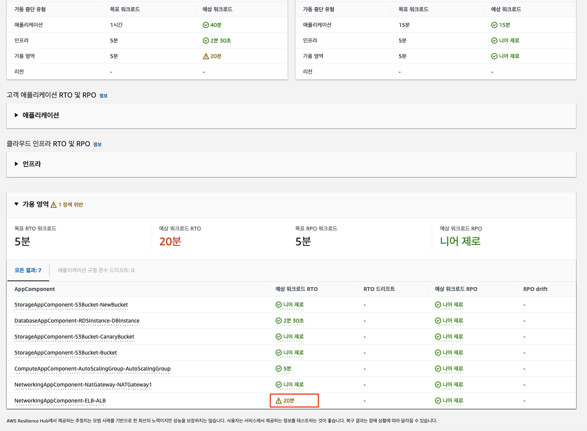

# [7. (도전 과제) Auto Scaling Group (ASG)에서 발생 가능한 가용 영역 장애 테스트]()

추가적으로 흥미로운 도전 과제를 드리고 함께 풀어보는 시간을 가지고자 합니다.

## [과제 1. Auto Scaling Group의 가용 영역 장애 실험 템플릿 구현 및 시뮬레이션 테스트]()

> Hypothesis
> 
> 하나의 가용 영역에 속한 모든 웹 어플리케이션 인스턴스가 중지되더라도 정의된 RTO/RPO 목표를 준수한다.

### [지침 (Instruction)]()
1. 이전 Step에서 수행한 작업을 참고, 적당한 **"오류 주입 실험 (Fault injection experiment)"** 템플릿을 생성하고 다운로드하여 CloudFormation 스택으로 배포 합니다.
2. 그런 후 생성된 실험 (Experiment)를 시작하고 어플리케이션의 Canary 상태를 모니터링합니다.

## [과제 2. 인프라 파이프라인 파일을 수정하여 가용 영역에 대한 복원력 정책 준수 실패를 유도]()

### [지침 (Instruction)]()
1. 우리는 이미 랩의 이전 과정을 통하여 인프라 파이프라인을 활용하였습니다.
   1. 인프라 파이프라인은 Cloud9의 아래 폴더에 정의되어 있습니다.
```shell
~/environment/arh-lab-repo/workload.yaml 
```

2. 위 파일의 딱 한줄을 바꾸고 아래를 수행하면 인프라가 업데이트되어 배포되기는 하지만 복원력 검사 (Resilience Check)을 통과하지 못하도록 만들 수 있습니다.
3. 해당 줄을 식별하고 수정하여 아래와 같은 Assessment 상태가 되도록 유도해 보십시요.<br>
4. <u>***(힌트) AWS EC2의 자동 확장을 구성할 때 기본적으로 고려하는 요소는 CloudWatch Metric, ELB, 그리고 Auto Scaling Group입니다. 이 챌린지의 경우에는 ELB의 대상 타겟을 공급하는 Auto Scaling Group 설정 중 한줄을 고의적으로 누락해 봄으로써 아래와 같은 복원력이 저하된 상태를 만들 수 있습니다.***</u><br>
> 
> 

<hr>

## [[이전]](./6-Integrate-Resilience-Checks-into-CICD-Pipelines.md) | [[다음]](./8-Lab-Clean-up.md)
